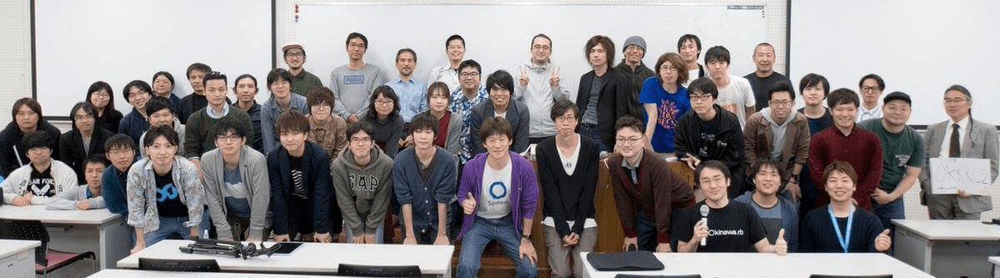
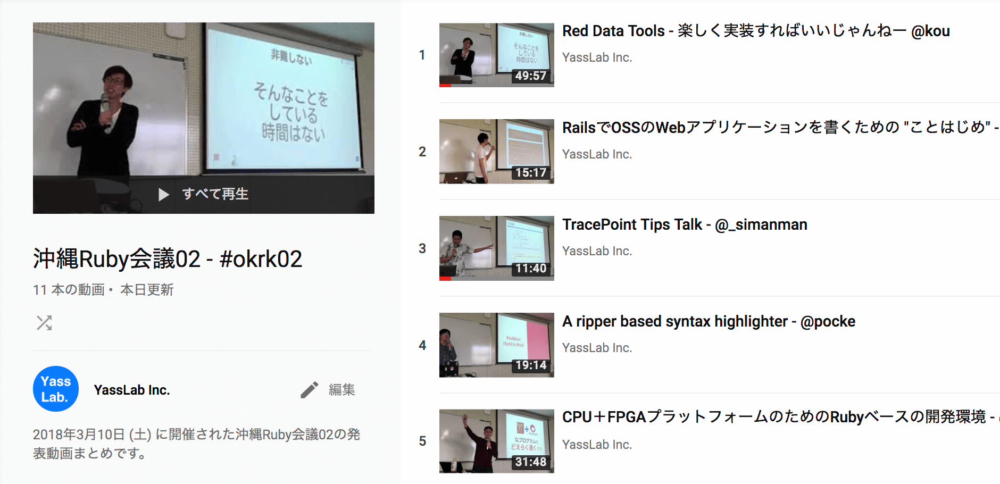
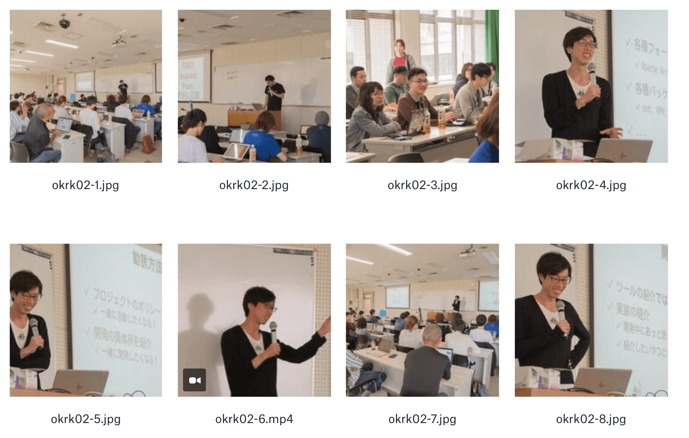

# 多くのご参加ありがとうございました😆

当日の様子は動画と写真で記録し、[YouTube の CC BY](https://support.google.com/youtube/answer/2797468?hl=ja) ライセンスで公開しております。動画や写真で当日の雰囲気を味わって頂ければ幸いです📹📸
 
 

📹 動画

<a href="https://www.youtube.com/playlist?list=PLNLYzHXJU2-84dl1iyRuGMJS9F2_7rArA">発表動画まとめ - YouTube</a>

 

📸 写真

<a href="https://www.dropbox.com/sh/s2mw6gvsj052fta/AABDnWKwdsAtQiDX9g9315OUa">当日の様子 (写真)</a>

 
以下、記録用として、開催直前のWebサイトをそのまま残しております。
今後の地域Ruby会議開催のご参考になれば幸いです ;) 

# 2018/03/10 (土)

琉球大学 工学部１号館 大教室 321 / 322

- 321: Session space (本会場)
- 322: Open space (予備会場)
- Access: [Google Map](https://www.google.com/maps/d/u/0/viewer?oe=UTF8&msa=0&ie=UTF8&brcurrent=3%2C0x34e56d1df2e32fe5%3A0xb46dc2f85de43f4b%2C1&mid=1mzwiSyQzTAi0hbKYrwrjgs7tmo4&ll=26.253345999999993%2C127.76630999999998&z=17)
- Hashtag: [#okrk02](https://twitter.com/search?f=tweets&q=okrk02%20OR%20%E6%B2%96%E7%B8%84Ruby%E4%BC%9A%E8%AD%B0&src=typd)
- 参加費: 無料

**沖縄Ruby会議02を開催します!** 当日はRubyに関するテクニカルな話から、OSSコミュニティや仕事での話、また、それぞれが取り組んでいるプロジェクトの進捗発表などが行われます🗣

今年は前回に比べてなるべく **「まったり」** と準備を進めており、豪勢な飾りやおもてなしなどはありません。運営にあまりコストをかけず、気軽に沖縄で集まる **「場づくり」** に繋がればと考えています。

運営は省エネですが **スピーカーは県内外から集まっている** ので、様々な Rubyist たちが沖縄で交流する機会には打ってつけです! 県内外の Rubyist が集まる貴重な機会なので、ぜひこの機会に参加してみてはいかがでしょうか? 🏃💨

参加フォーム

<a data-width="500" class="doorkeeper-registration-widget" href="https://okinawarb.doorkeeper.jp/events/70507">沖縄Ruby会議02</a>
 

懇親会フォーム

イベント終了後、懇親会も開催されます。皆さんのご参加をお待ちしております ;)
[https://okinawarb.doorkeeper.jp/events/71312](https://okinawarb.doorkeeper.jp/events/71312)
 

# Guest Speakers

<ul class="tile">
<li>
<a href="https://github.com/kou">Kouhei Sutou</a> Ruby commiter <a href="https://red-data-tools.github.io/">Red Data Tools</a>
</li>
<li>
<a href="https://github.com/mrkn">Kenta Murata</a> Ruby committer Ruby をデータサイエンス分野に 対応させる活動の現況
</li>
<li>
<a href="https://github.com/maruuusa83">Daichi Teruya</a> 2017年度 未踏クリエイター 
<a href="https://www.ipa.go.jp/jinzai/mitou/2017/gaiyou_s-1.html">CPU＋FPGAプラットフォームのためのRubyベースの開発環境</a>

</li>
</ul>

<!--

発表者募集

**沖縄Ruby会議で発表してみませんか?** Ruby の面白テクニック、コミュニティに行ってみた感想、仕事で Ruby を使ってみた話、個人プロジェクトの進捗など、何でも大丈夫です👌 皆さんのご応募をお待ちしております ;)

📮  応募フォーム (定員になり次第、締め切りとなります)
[https://goo.gl/forms/iNijTSwmUnfHGkcP2](https://goo.gl/forms/iNijTSwmUnfHGkcP2)
-->

# Timetable

<table class="tg">
  <tr>
    <th>時間</th>
    <th>タイトル</th>
  </tr>
  <tr>
    <td class="center">12:30〜</td>
    <td class="center">開場</td>
  </tr>
  <tr>
    <td class="center">13:00〜</td>
    <td class="center">オープニング <a href="https://twitter.com/yasulab">@yasulab</a></td>
  </tr>
  <tr>
    <td class="center">13:10〜</td>
    <td class="center">Red Data Tools <a href="https://github.com/kou">@kou</a></td>
  </tr>
  <tr>
    <td class="center">14:00〜</td>
    <td class="center">
	RailsでOSSのWebアプリケーションを書くための 'ことはじめ' 
	<a href="https://github.com/kami-zh">@kami-zh</a>  
	TracePoint Tips Talk 
	<a href="https://twitter.com/_simanman">@_simanman</a>  
	A ripper based syntax highlighter 
	<a href="https://github.com/pocke">@pocke</a>
	</td>
  </tr>
  <tr>
    <td class="center break" colspan="2">Break &amp; Ask the speaker</td>
  </tr>
  <tr>
    <td class="center">15:00〜</td>
    <td class="center">CPU＋FPGAプラットフォームのためのRubyベースの開発環境 
	<a href="https://github.com/maruuusa83">@maruuusa83</a></td>
  </tr>
  <tr>
    <td class="center">15:30〜</td>
    <td class="center">ActiveRecord::ConnectionAdapters の下の世界 
	<a href="https://twitter.com/koic">@koic</a>  
	はじめてのアジャイル開発×Railsで得たこと 
	<a href="https://twitter.com/puremoru0315">@puremoru0315</a>  
	Fast Code for Ruby 
	<a href="https://twitter.com/284km">@284km</a></td>
  </tr>
  <tr>
    <td class="center break" colspan="2">Break &amp; Ask the speaker</td>
  </tr>
  <tr>
    <td class="center">16:30〜</td>
    <td class="center">
	文系から半年でRuby（Sinatra, Rails）を学んだら人生変わった 
	<a href="https://github.com/masayoshi-tokumoto">@masayoshi-tokumoto</a>  
	<s>Rubyの起動処理刷新計画</s> 
	<s><a href="https://github.com/ko1">@ko1</a></s> 
	都合によりキャンセルになりました 🙏  
	大規模Railsアプリのマイクロサービス化・序章 
	<a href="https://github.com/yotaro-fujii">@yotaro-fujii</a>
	</td>
  </tr>
  <tr>
  <td class="center">17:00〜</td>
    <td class="center">Ruby をデータサイエンス分野に対応させる活動の現況 
	<a href="https://twitter.com/mrkn">@mrkn</a></td>
  </tr>
  <tr>
    <td class="center">17:50〜</td>
    <td class="center">クロージング &amp; 集合写真 
	<a href="https://twitter.com/yasulab">@yasulab</a></td>
  </tr>
  <tr>
    <td class="center">18:00</td>
    <td class="center">解散</td>
  </tr>
  <tr>
    <td class="center">18:30〜</td>
    <td class="center">懇親会 (要: <a href="https://okinawarb.doorkeeper.jp/events/71312">申し込み</a>)</td>
  </tr>
</table>

イベント終了後、懇親会も開催されます。皆さんのご参加をお待ちしております  🍻✨
[https://okinawarb.doorkeeper.jp/events/71312](https://okinawarb.doorkeeper.jp/events/71312)

# Sponsors

<ul class="tile">
<li> </li>
<li> </li>
<li> </li>
<li> </li>
</ul>

沖縄Ruby会議を支えるスポンサー企業を募集しています 💰  
３万円からの支援が可能で、Webサイトに御社ロゴを掲載します🏢✨ 
それ以上の支援については `okrk02@ruby.okinawa` までご連絡ください 📩

参考: <a href="http://magazine.rubyist.net/?0047-OkinawaRubyKaigi01Report">前回のレポート (Rubyist Magazine)</a>

# Organizers

<a href="https://twitter.com/yasulab">@yasulab</a>,
<a href="https://twitter.com/saboyutaka">@saboyutaka</a>, 
<a href="https://twitter.com/himajin315">@himajin315</a>,
<a href="https://twitter.com/naopontan">@naopontan</a>, 
<a href="https://twitter.com/nanophate">@nanophate</a>,
<a href="https://twitter.com/The_Na_Ka">@The_Na_Ka</a>, 
<a href="https://twitter.com/nankuru_free">@nankuru_free</a>,
<a href="https://twitter.com/@7kosei">@7kosei</a>

- 主催: [Okinawa Ruby User Group](http://ruby.okinawa/)
- 共催: [国立大学法人 琉球大学](http://www.u-ryukyu.ac.jp/)
- 後援: [一般社団法人 日本Rubyの会](http://ruby-no-kai.org/)

---------------------------
