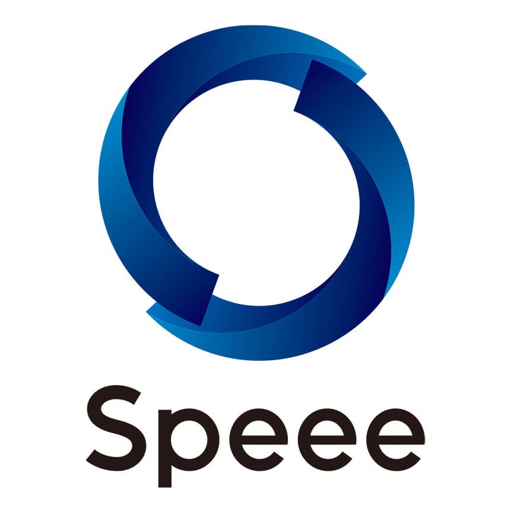
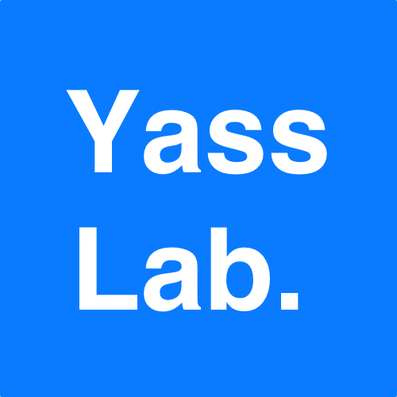

# 2018/03/10 (土)

琉球大学 工学部１号館 大教室 322 / 321

- 322: Session space
- 321: Open space (もくもく部屋)
- Access: [Google Map](https://maps.google.co.jp/maps/ms?ie=UTF8&brcurrent=3,0x34e56d1df2e32fe5:0xb46dc2f85de43f4b,1&oe=UTF8&msa=0&msid=105655023061209926360.0004954ae235a0ff9b428)
- Hashtag: [#okrk02](https://twitter.com/search?f=tweets&q=okrk02%20OR%20%E6%B2%96%E7%B8%84Ruby%E4%BC%9A%E8%AD%B0&src=typd)

# Speakers

<ul class="tile">
<li>
<a href="https://github.com/kou">Kouhei Sutou</a> Ruby commiter TBD
</li>
<li>
<a href="https://github.com/mrkn">Kenta Murata</a> Ruby committer <a href="https://github.com/mrkn/pycall.rb">PyCall</a> の話 (仮)
</li>
<li>
<a href="https://github.com/maruuusa83">Daichi Teruya</a> 2017年度 未踏クリエイター 
<a href="https://www.ipa.go.jp/jinzai/mitou/2017/gaiyou_s-1.html">CPU＋FPGAプラットフォームのためのRubyベースの開発環境</a>

</li>
</ul>

発表者募集

**沖縄Ruby会議で発表してみませんか?** Ruby の面白テクニック、コミュニティに行ってみた感想、仕事で Ruby を使ってみた話、個人プロジェクトの進捗など、何でも大丈夫です👌 皆さんのご応募をお待ちしております ;)

📮  応募フォーム(〆切: 2017年12月31日)
[https://goo.gl/forms/iNijTSwmUnfHGkcP2](https://goo.gl/forms/iNijTSwmUnfHGkcP2)

_※ 応募状況によっては、後日再募集をかけることがあります。あらかじめご了承ください。_

# Sponsors

<ul class="tile">
<li> </li>
<li> </li>
</ul>

沖縄Ruby会議を支えるスポンサー企業を募集しています 💰  
詳しくは `okrk02@ruby.okinawa` までご連絡ください 📩

参考: <a href="http://ruby.okinawa/okrk01/">前回の沖縄Ruby会議</a>

# Organizers

- 主催: [Okinawa Ruby User Group](http://ruby.okinawa/)
- 共催: [国立大学法人 琉球大学](http://www.u-ryukyu.ac.jp/)
- 後援: [一般社団法人 日本Rubyの会](http://ruby-no-kai.org/)
